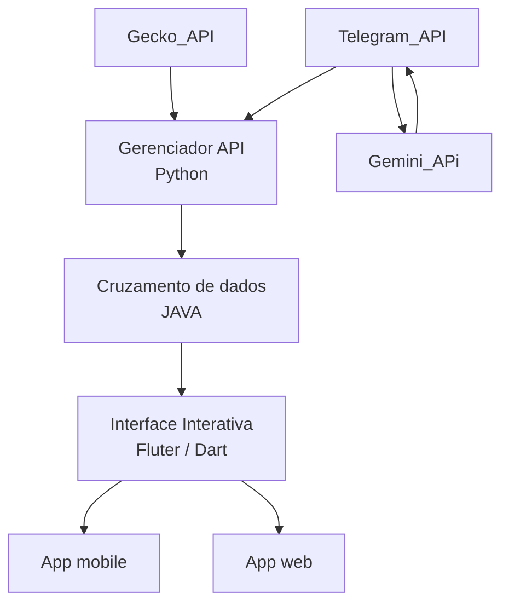

# projeto-millie-app
## Objetivo

O Milie tem como objetivo ajudar o usuário a encontrar a **forma mais econômica** e inteligente de comprar passagens aéreas, **comparando preços em dinheiro e em milhas**.
A plataforma pesquisa oportunidades na web, identifica promoções de passagens, transferências bonificadas e compra de milhas, além de realizar cálculos para **indicar qual estratégia apresenta o melhor custo-benefício.**

## Stakeholders
### Equipe Devs
 Nome                   | Cargo             |
| ----------------------|:-------------:    |
| Lamôni Leal Pereira   | Product owner     |
| Mateus Coelho         | Dev Backend       |
| Luiza Mariano         | Desinger          |
| Arthur Utsch          | Dev Frontend      |
| Bruno Santiago        | Aux. Técnico e ADM|

## Diagrama Estrutural do Projeto

## Pricipais Funcionalidades
1. **Pesquisa de passagens:**

Busca passagens aéreas disponíveis na web, apresentando valores em dinheiro e milhas.

2. **Comparação dinheiro x milhas**

Compara o custo de comprar a passagem em reais com o custo de emitir utilizando milhas.

3. **Busca de promoções**

Identifica oportunidades de:
Transferência bonificada de pontos;
Compra de milhas com desconto;
Bônus em programas de fidelidade;
Promoções de passagens aéreas.

4. **Calculadora de milhas**

Permite simular quanto o usuário gastará para adquirir milhas necessárias para uma viagem.

5. **Análise de custo-benefício**

Considera os valores envolvidos na operação e calcula qual alternativa possui o menor custo efetivo.
6. **Recomendação de estratégia**

O Milie apresenta uma recomendação, como:
“Melhor estratégia: comprar a passagem em dinheiro.”
ou “Melhor estratégia: transferir seus pontos com 100% de bônus e emitir utilizando milhas.”

7. **Dashboard personalizado**

Centraliza pesquisas, promoções, oportunidades e resultados das simulações do usuário.
